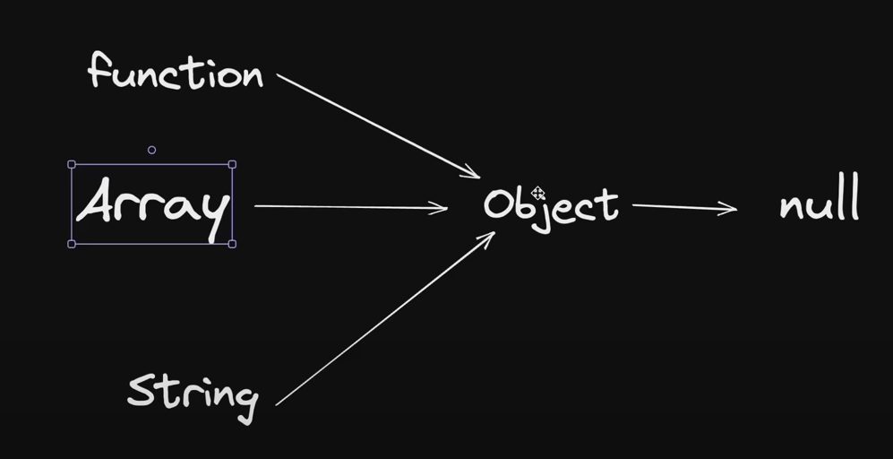

# javascript and classes

## OOP

## Object
- collection of properties and methods
- toLowerCase

## why use OOP

## parts of OOP
Object literal 

- Constructor function
- Prototypes
 
example in 

- Instances (new, this)


## 4 pillars
Abstraction
Encapsulation
Inheritance
Polymorphism

Object-Oriented Programming (OOP) is based on four fundamental principles known as the "Four Pillars of OOP." These principles help structure and design software systems in a more modular and organized way. The four pillars are:

1. **Encapsulation:**
   - Encapsulation is the concept of bundling data (attributes) and the methods (functions) that operate on the data into a single unit known as a class. It enforces data hiding and protects the internal state of an object from unauthorized access. Public methods provide controlled access to the object's data.

   **Example:**

   ```javascript
   class Person {
     constructor(name, age) {
       this.name = name;
       this.age = age;
     }

     greet() {
       console.log(`Hello, my name is ${this.name} and I'm ${this.age} years old.`);
     }
   }

   const person1 = new Person("Alice", 30);
   person1.greet(); // Accessing data via a method (encapsulation)
   ```

2. **Abstraction:**
   - Abstraction focuses on simplifying complex reality by modeling classes based on their essential characteristics. It involves hiding the unnecessary details of an object and showing only the necessary features to the user.

   **Example:**

   ```javascript
   class Shape {
     getArea() {
       // Abstract method to be implemented by subclasses
     }
   }

   class Circle extends Shape {
     constructor(radius) {
       super();
       this.radius = radius;
     }

     getArea() {
       return Math.PI * this.radius ** 2;
     }
   }

   const circle = new Circle(5);
   console.log("Area of the circle:", circle.getArea());
   ```

   In this example, the `Shape` class defines an abstract method `getArea()` that must be implemented by its subclasses.

3. **Inheritance:**
   - Inheritance allows a new class (subclass or derived class) to inherit properties and methods from an existing class (superclass or base class). This promotes code reusability and allows you to create specialized classes based on more general ones.

   **Example:**

   ```javascript
   class Vehicle {
     constructor(make, model) {
       this.make = make;
       this.model = model;
     }

     start() {
       console.log("Engine started.");
     }
   }

   class Car extends Vehicle {
     drive() {
       console.log(`Driving the ${this.make} ${this.model}.`);
     }
   }

   const myCar = new Car("Toyota", "Camry");
   myCar.start(); // Inherited method
   myCar.drive(); // Method in the subclass
   ```

   The `Car` class inherits properties and methods from the `Vehicle` class.

4. **Polymorphism:**
   - Polymorphism means that objects of different classes can be treated as objects of a common superclass. It allows you to define methods in a superclass and implement them differently in the subclasses. This concept enables flexibility and dynamic behavior.

   **Example:**

   ```javascript
   class Animal {
     makeSound() {
       console.log("Animal makes a sound.");
     }
   }

   class Dog extends Animal {
     makeSound() {
       console.log("Dog barks.");
     }
   }

   class Cat extends Animal {
     makeSound() {
       console.log("Cat meows.");
     }
   }

   const animals = [new Dog(), new Cat()];

   animals.forEach((animal) => {
     animal.makeSound(); // Dynamic method invocation
   });
   ```

   In this example, both `Dog` and `Cat` classes override the `makeSound` method from the `Animal` class. When we call `makeSound()` on instances of these classes, it exhibits polymorphic behavior.

The Four Pillars of OOP provide a solid foundation for designing software systems that are organized, maintainable, and extensible. They promote code reuse, modularity, and clear structure in your programs.